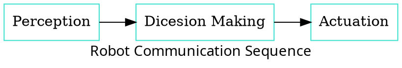
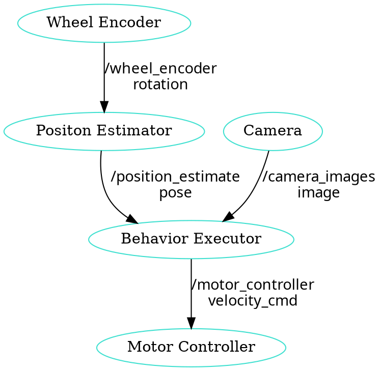
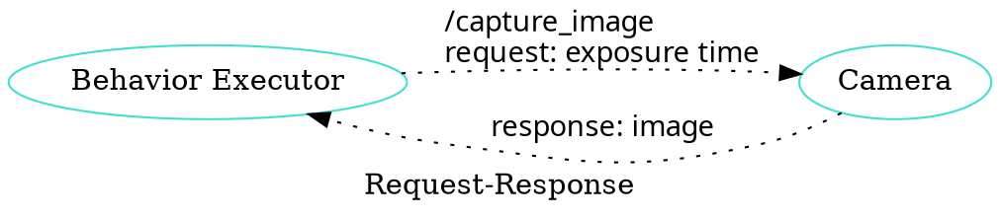

# ROS 2 Programming

 - 수업자료: https://learn.dronemap.io/ros-workshop/ros2/
 - 준비물: ubuntu 20.04 리눅스가 설치된 컴퓨터
 - 참고책: ROS 2로 시작하는 로봇 프로그래밍

----

## 1. 수업 소개

-   목표: UGV 제어 소프트웨어에 대해 이해할 수 있고, 프로그래밍 환경을 구축할 수 있다.
-   교재: [https://learn.dronemap.io/ros-workshop/rover/1.html](https://learn.dronemap.io/ros-workshop/rover/1.html)
-   코치: 박동희 dongheepark@gmail.com

## 2. UGV 제어 소프트웨어 소개 및 설치

1. 워크숍 소개, 참가자 소개
2. ROS 2 소개
3. Linux 사용하기
4. ROS 2 개발환경 구성

## 3. Linux 사용하기

-   Ubuntu 20.04 설치
-   주요 명령어 소개(파일 조작, 프로그램설치, 쉘스크립트, git)
-   디렉토리 소개

ls: 파일 또는 디렉토리의 목록을 출력
```
ls
ls -al
```

cd: 디렉토리 이동
```
cd ~
cd ~/Downloads
```

pwd: 현재 디렉토리 출력
```
pwd
```

mkdir: 디렉토리 생성
```
mkdir tmp
```

rm: 파일 또는 디렉토리 지우기
```
rm -rf tmp
```

cat: 파일 입력 또는 출력

```
cat ~/.bashrc
cat > ~/hello.c
```


cp: 파일 또는 디렉토리 복사

```
cp hello.c world.c
```

gcc: c코드 컴파일


```
gcc hello.c -o hello
```

chmod: 파일의 퍼미션 지정

```
chmod +x hello
```

wget: url에서 파일 다운로드

```
wget https://google.com
```

source: 현재 쉘에서 파일을 읽고 실행

```
source ~/.bashrc
```

git: 버전 관리, 코드 다운로드

```
git init
git clone
git checkout
git add
git commit
git reset
git push
```

IP 확인 방법

```
ifconfig -a
ip addr
```

우분트 패키지 설치

```
sudo apt-get update
sudo apt-get install //설치할 패키지
sudo apt-get remove //삭제할 패키지
sudo apt-get upgrade
```


## ROS 2 foxy 개발환경 구성
  
### PC에 설치된 우분트 18.04에 ROS melodic 설치하기


<http://wiki.ros.org/melodic/Installation/Ubuntu>

  우분트 패키지 소스 리스트에 ROS melodic 추가

```
sudo sh -c 'echo "deb http://packages.ros.org/ros/ubuntu $(lsb_release -sc) main" > /etc/apt/sources.list.d/ros-latest.list'
```

  
```
sudo apt install curl # if you haven't already installed curl
```

```
curl -s https://raw.githubusercontent.com/ros/rosdistro/master/ros.asc | sudo apt-key add -
```


ROS 데스크탑 패키지 설치

```
sudo apt-get update
sudo apt install ros-melodic-desktop-full
```

ROS 환경 변수 설정

```
echo "source /opt/ros/melodic/setup.bash" >> ~/.bashrc
source ~/.bashrc
```
  
ROS 유저 패키지 빌드를 위한 도구 설치

```
sudo apt install python-rosdep python-rosinstall python-rosinstall-generator python-wstool build-essential
```


### Raspberry PI에 ROS Melodic 설치하기

<http://wiki.ros.org/ROSberryPi/Installing%20ROS%20Melodic%20on%20the%20Raspberry%20Pi>

```
sudo sh -c 'echo "deb http://packages.ros.org/ros/ubuntu $(lsb_release -sc) main" > /etc/apt/sources.list.d/ros-latest.list'
sudo apt-key adv --keyserver 'hkp://keyserver.ubuntu.com:80' --recv-key C1CF6E31E6BADE8868B172B4F42ED6FBAB17C654
sudo apt-get update
sudo apt-get install -y python-rosdep python-rosinstall-generator python-wstool python-rosinstall build-essential 
cmake
sudo rosdep init
rosdep update
mkdir ~/ros_catkin_ws

cd ~/ros_catkin_ws
```

```
rosinstall_generator ros_comm --rosdistro melodic --deps --wet-only --tar > melodic-ros_comm-wet.rosinstall
wstool init src melodic-ros_comm-wet.rosinstall

cd ~/ros_catkin_ws
rosdep install -y --from-paths src --ignore-src --rosdistro melodic -r --os=debian:buster
sudo ./src/catkin/bin/catkin_make_isolated --install -DCMAKE_BUILD_TYPE=Release --install-space /opt/ros/melodic -j2
source /opt/ros/melodic/setup.bash
echo "source /opt/ros/melodic/setup.bash" >> ~/.bashrc
```


## ROS 프로그래밍  

### ROS

- Robot Operating System: 로봇 빌드에 사용되는 라이브러리 어플리케이션 모음 <http://www.ros.org/>
- 목표: 로봇을 만들때 기존의 재활용 하고 공유하자.
- History:
	- 2000s: Standford Artificial intelligence
	- 2007: Willow Garage
	- 2013: Open Source Robotics Foundation
	- 2017: ROS 2 첫버전 릴리즈
- 사용 분야: Drone, Kinematic ARMS(로봇암), Wheeled(바퀴), Bi-pedal(이족)

### ROS Nodes and Topics



- Perception: Sense
	- Sensor Fusion
	- Filtering
	- Localization 
  
- Dicesion Making: Decide
	- Path Planning
	- Prediction
	- Behavior Planning

- Actuation: Act
	- PID Control
	- Model Predictive Control

### ROS Master Process
 
노드 관리


### Topics  

노드간 통신 인터페이스. 구독 발행의 이름


 

### Publish and Subscribe  

발행과 구독. 신문/잡지 발행 구독에 비유


실제 예제
 


## ROS Message Passing

메시지: 노드간 통신할때 이동하는 실제 데이터
- 메시지는 텍스트로 구성. 메시지를 이해하기 쉽다.

미리 정의된 메시지 타입 :
- <http://wiki.ros.org/common_msgs>
- <https://github.com/ros/common_msgs>

  
### ROS Services
- Request-Response, 1:1 통신
- PubSub이 필요 없는 경우 사용, 요청 할때만 데이터가 제공. 네트워크 부하가 적다.
 
### 예시: 카메라 이미지 얻기
 

 

 
### ROS Turtlesim  

Turtle


#### Turtlesim 실행하기


1.  환경 변수 설정

    source /opt/ros/melodic/setup.bash

2.  roscore 실행
    -   roscore: Master + rosout + parameter server
        -   Master: 네임 서비스
        -   rosout: stdout/stderr 로깅
        -   parameter server: 파라미터 저장 서버

```
roscore
```
  
3.  turtlesim 패키지의 `turtlesim_node` 실행

```
rosrun turtlesim turtlesim_node
```

4.  turtlesim 패키지의 `turtle_teleop_key` 실행

```
rosrun turtlesim turtle_teleop_key
```


#### Turtlesim 노드 목록
```
rosnode list
```

/rosout : ROS 메시지 로깅.

### Turtlesim 토픽 목록  
```
rostopic list
```

### Turtlesim 토픽 정보
```
rostopic info /turtle1/cmd_vel
```

### Turtlesim 메시지 정보
```
$ rosmsg info geometry_msgs/Twist
geometry_msgs/Vector3 linear
  float64 x
  float64 y
  float64 z
geometry_msgs/Vector3 angular
  float64 x
  float64 y
  float64 z
```
or
```
rosed geometry_msgs Twist.msg
```  

#### Turtlesim Echo a Topic

디버깅시 편리

```
rostopic echo /turtle1/cmd_vel
```

#### `rqt_graph`

    rqt_graph

