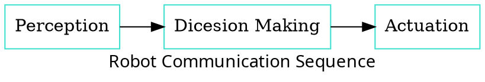
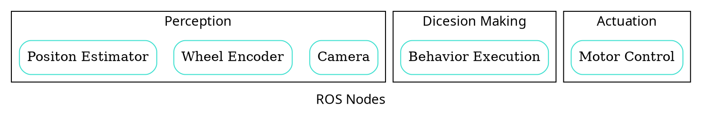
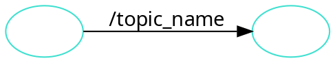
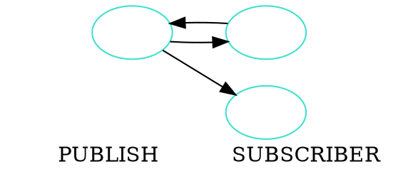
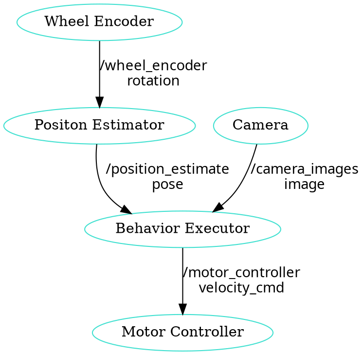
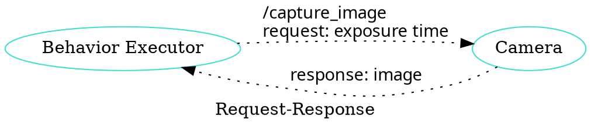
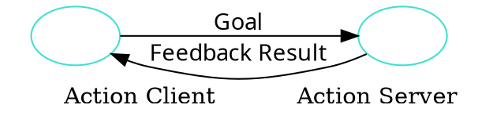

# ROS 2 Programming Day 1

- 수업자료: https://learn.dronemap.io/ros-workshop/ros2/
- 준비물: ubuntu 20.04 리눅스가 설치된 컴퓨터
- 참고책: ROS 2로 시작하는 로봇 프로그래밍

## 수업 소개

- 목표: ROS2 로봇 개발 환경 구축하고 ROS 2를 이용하여 제어 프로그램을 개발 할 수 있다.
- 교재: [https://learn.dronemap.io/ros-workshop/ros2/#/day1](https://learn.dronemap.io/ros-workshop/ros2/#/day1)
- 코치: 박동희 dongheepark@gmail.com

1. 워크숍 소개, 참가자 소개
2. ROS 2 소개
3. Linux 사용하기
4. ROS 2 개발환경 구성
5. ROS 2 기본 프로그래밍

## Linux 사용하기

- Ubuntu 20.04 설치
- 주요 명령어 소개(파일 조작, 프로그램설치, 쉘스크립트, git)
- 디렉토리 소개

virtualbox ubuntu 20.04 ova 이미지 https://cloud.baribarilab.com/s/csjC5dXrqgRrGsT

### 주요 명령어

ls: 파일 또는 디렉토리의 목록을 출력

```
ls
ls -al
```

cd: 디렉토리 이동

```
cd ~
cd ~/Downloads
```

pwd: 현재 디렉토리 출력

```
pwd
```

mkdir: 디렉토리 생성

```
mkdir tmp
```

rm: 파일 또는 디렉토리 지우기

```
rm -rf tmp
```

cat: 파일 입력 또는 출력

```
cat ~/.bashrc
cat > ~/hello.c
```

cp: 파일 또는 디렉토리 복사

```
cp hello.c world.c
```

gcc: c코드 컴파일

```
gcc hello.c -o hello
```

chmod: 파일의 퍼미션 지정

```
chmod +x hello
```

wget: url에서 파일 다운로드

```
wget https://google.com
```

curl: url의 파일 다운로드

```
wget https://google.com
```

source: 현재 쉘에서 파일을 읽고 실행

```
source ~/.bashrc
```

ps: 실행중인 프로세스 목록 나열

```
ps aux
```

kill: 프로세스 종료. 죽이기

```
kill 프로세스번호
```

IP 확인 방법

```
ifconfig -a
ip addr
```

우분트 패키지 설치

```
sudo apt update
sudo apt install //설치할 패키지
sudo apt remove //삭제할 패키지
sudo apt upgrade
```

git: 버전 관리, 코드 다운로드


```
git init

git add
git commit
git push

git clone
git checkout
git branch
```

**해보기:**

- github에 새로운 코드 저장소를 만들어서 README.md 파일을 수정 해보자.
- 힌트: github 가입, 새로운 저장소 추가, ssh 키추가. README.md 수정, 커밋, push
- https://www.youtube.com/watch?v=RGOj5yH7evk

리눅스에서 ssh 생성

```
ssh-keygen

cat ~/.ssh/id_rsa.pub
```

### 코드 편집기 Visual Studio Code 설치

다음 주소에서 Debian. Ubuntu용 패키지 다운받아서 설치

https://code.visualstudio.com/download

```
cd ~/Downloads
sudo dpkg -i code_1.69.2-1658162013_amd64.deb
```

## ROS 2 foxy 개발환경 구성

### PC에 설치된 우분트 20.04에 ROS 2 foxy 설치하기

https://docs.ros.org/en/foxy/Installation/Ubuntu-Install-Debians.html

UTF-8 로케일 설정

```
sudo apt update && sudo apt install locales
sudo locale-gen en_US en_US.UTF-8
sudo update-locale LC_ALL=en_US.UTF-8 LANG=en_US.UTF-8
export LANG=en_US.UTF-8

locale
```

우분트 패키지 소스 리스트에 ROS 2 foxy 추가

```
sudo apt update && sudo apt install curl gnupg2 lsb-release
sudo curl -sSL https://raw.githubusercontent.com/ros/rosdistro/master/ros.key  -o /usr/share/keyrings/ros-archive-keyring.gpg
```

```
echo "deb [arch=$(dpkg --print-architecture) signed-by=/usr/share/keyrings/ros-archive-keyring.gpg] http://packages.ros.org/ros2/ubuntu $(source /etc/os-release && echo $UBUNTU_CODENAME) main" | sudo tee /etc/apt/sources.list.d/ros2.list > /dev/null
```

ROS foxy 데스크탑 패키지 설치

```
sudo apt-get update
sudo apt install ros-foxy-desktop
```

ROS foxy 환경 변수 설정

```
echo "source /opt/ros/foxy/setup.bash" >> ~/.bashrc
source ~/.bashrc
```

ROS 2 사용자 패키지 빌드를 위한 도구 colcon 설치

```
sudo apt install python3-colcon-common-extensions
```

ROS 2 환경 구분을 위한 도메인 아이디 설정

자신의 도메인 아이디를 ~/.bashrc에 추가 한다.

```
export ROS_DOMAIN_ID=0 # 강사
export ROS_DOMAIN_ID=10
export ROS_DOMAIN_ID=20
export ROS_DOMAIN_ID=30
export ROS_DOMAIN_ID=40
export ROS_DOMAIN_ID=50
export ROS_DOMAIN_ID=60
```

사용법

```
ROS_DOMAIN_ID=10 ros2 topic list
```

### Visual Studio Code 확장 설치

- C/C++, CmMake, CMake Tools, Python
- ROS, URDF, Colcon Tasks
- XML Tools, YAML, Markdown All in One

## ROS 2 소개

### ROS

- Robot Operating System: 로봇 빌드에 사용되는 라이브러리 어플리케이션 모음 <http://www.ros.org/>
- 목표: 로봇을 만들때 기존의 재활용 하고 공유하자.
- History:
  - 2000s: Standford Artificial intelligence
  - 2007: Willow Garage
  - 2013: Open Source Robotics Foundation
  - 2017: ROS 2 첫버전 릴리즈
- 사용 분야: Drone, Kinematic ARMS(로봇암), Wheeled(바퀴), Bi-pedal(이족)

### ROS 2 왜?

- 리얼타임
- 임베디드 시스템
- Linux, macOS, Windows 지원
- 통신 QOS 지원: 안정성 향상
- 다양한 프로그래밍 언어 호환: RCL

### ROS 2 구조


### ROS Nodes and Topics



- Perception: Sense

  - Sensor Fusion
  - Filtering
  - Localization

- Dicesion Making: Decide

  - Path Planning
  - Prediction
  - Behavior Planning

- Actuation: Act
  - PID Control
  - Model Predictive Control

### ROS Nodes



## ROS 인터페이스

ROS에서 노드간 통신(토픽, 서비스, 액션)할때 이동하는 데이터 타입

미리 정의된 메시지 타입 :

- https://github.com/ros2/common_interfaces

- 토픽: msg 파일
- 서비스: srv 파일
- 액션: action 파일

### Topics

노드간 통신 인터페이스. 구독 발행의 이름



### Publish and Subscribe

발행과 구독. 신문/잡지 발행 구독에 비유



실제 예제



### Services

- Request-Response, 1:1 통신
- PubSub이 필요 없는 경우 사용, 요청 할때만 데이터가 제공. 네트워크 부하가 적다.


### 예시: 카메라 이미지 얻기




### Action

- Service + Message Passing
- 비동기식 양방향 메시지 송수신 방식
- Goal/Feedback/Result




## ROS Turtlesim

Turtle


### Turtlesim 실행하기


1. 환경 변수 설정
   ```
   source /opt/ros/foxy/setup.bash
   ```
2. turtlesim 패키지 설치 확인
   ```
   ros2 pkg executables turtlesim
   ```
3. turtlesim 패키지의 `turtlesim_node` 실행
   ```
   ros2 run turtlesim turtlesim_node
   ```
4. turtlesim 패키지의 `turtle_teleop_key` 실행
   ```
   ros2 run turtlesim turtle_teleop_key
   ```

### Turtlesim 노드 정보

노드 목록 보기

```
ros2 node list
```

노드 정보 보기

```
ros2 node info /turtlesim
```

노드 라이프사이클 (turtlesim에는 없음)

```bash
ros2 lifecycle nodes
ros2 lifecycle list 노드이름
ros2 lifecycle get 노드이름
ros2 lifecycle set 노드이름 configure/activate/deactivate/cleanup/shutdown
```

### Turtlesim 토픽 목록

```
ros2 topic list
```

### Turtlesim 토픽 정보

`cmd_vel` 토픽 정보 보기

```
ros2 topic info /turtle1/cmd_vel
```

토픽 publish

```
ros2 topic pub --once /turtle1/cmd_vel geometry_msgs/msg/Twist '{linear: {x: 2.0, y: 0.0, z: 0.0}, angular: {x: 0.0, y: 0.0, z: 1.8}}'
```

### Turtlesim 메시지 정보

```
ros2 interface list
```

```
$ ros2 interface show geometry_msgs/msg/Twist
geometry_msgs/Vector3 linear
  float64 x
  float64 y
  float64 z
geometry_msgs/Vector3 angular
  float64 x
  float64 y
  float64 z
```

### Turtlesim Echo a Topic

디버깅시 편리

```
ros2 topic echo /turtle1/cmd_vel
```

### `rqt_graph`

rqt_graph


### `rqt`


### Turtlesim 서비스 정보

서비스 목록

```
ros2 service list -t
```

서비스 Call

```
ros2 service call /spawn turtlesim/srv/Spawn "{x: 2, y: 2, theta: 0.2, name: ''}"
```

### Turtlesim Action 정보

액션 목록

```
ros2 action list -t
```

액션 정보

```
ros2 action info /turtle1/rotate_absolute
```

액션 골 보내기 -90도 회전

```
ros2 action send_goal /turtle1/rotate_absolute turtlesim/action/RotateAbsolute {'theta:
-1.57'}
```

### Turtlesim Parameter 정보

파라미터 목록 가져오기

```
ros2 param list
```

```
ros2 param get /my_node use_sim_time
ros2 param set /my_node use_sim_time false
```

### rosbag2

노드 간 통신 메시지를 bag에 녹화하고 재생

bag 녹화

```
ros2 bag record /turtle1/cmd_vel
```

녹화된 bag 정보

```
ros2 bag info rosbag2_2022_07_24-20_10_23/
```

bag 재생

```
ros2 bag play rosbag2_2022_07_24-20_10_23/
```

## ROS 노드 만들기

### 새로운 노드 만들기

빌드 도구 colcon 설치하기

```
sudo apt install python3-colcon-common-extensions python3-rosdep2
```

#### 패키지 만들기

```
mkdir -p ~/ros2_ws/src
cd ~/ros2_ws/src
```

my_package 이름의 패키지 안에 my_node 이름 노드를 만들어 보자.

```
#ros2 pkg create --build-type ament_python my_package # my_package 만 만들경우
ros2 pkg create --build-type ament_python --node-name my_node my_package
```

- python package(ament_python) ? cmake 패키지(ament_cmake) --dependencies 의존패키지
- 의존 패키지 추가하기: ros2 pkg create --build-type ament_cmake --node-name my_node my_cpp_package --dependencies rclcpp

#### 패키지 빌드

```
cd ~/ros2_ws
colcon build --packages-select my_package
```

#### 패키지 노드 실행

환경 변수 설정

```
cd ~/ros2_ws
source install/setup.bash
```

노드 실행

```
ros2 run my_package my_node
```

#### 해보기: my_package 분석

- ros2_ws/src/my_package 안의 디렉토리와 파일을 분석하고 설명해보자.

#### 해보기: c++ 노드 패키지 작성

- c++ 코드로 구현된 my_cpp_package와 my_node 만들고, 그 노드를 실행해보자.
- 힌트: 패키지 만들때 ament_cmake 옵션 사용
- 참고: https://docs.ros.org/en/foxy/Tutorials/Beginner-Client-Libraries/Creating-Your-First-ROS2-Package.html

---

### 새로운 노드 만들기: Pub Sub 노드 만들기

#### 패키지 만들기

```
cd ~/ros2_ws/src
ros2 pkg create --build-type ament_python py_pubsub
```

#### 노드 코드 작성

~/ros2_ws/src/py_pubsub/py_pubsub/minimal_publisher.py

```
import rclpy
from rclpy.node import Node

from std_msgs.msg import String

class MinimalPublisher(Node):

    def __init__(self):
        super().__init__('minimal_publisher')
        self.publisher_ = self.create_publisher(String, 'topic', 10)
        timer_period = 0.5  # seconds
        self.timer = self.create_timer(timer_period, self.timer_callback)
        self.i = 0

    def timer_callback(self):
        msg = String()
        msg.data = 'Hello World: %d' % self.i
        self.publisher_.publish(msg)
        self.get_logger().info('Publishing: "%s"' % msg.data)
        self.i += 1


def main(args=None):
    rclpy.init(args=args)

    minimal_publisher = MinimalPublisher()

    rclpy.spin(minimal_publisher)

    minimal_publisher.destroy_node()
    rclpy.shutdown()


if __name__ == '__main__':
    main()
```

~/ros2_ws/src/py_pubsub/py_pubsub/minimal_subscriber.py

```
import rclpy
from rclpy.node import Node

from std_msgs.msg import String


class MinimalSubscriber(Node):

    def __init__(self):
        super().__init__('minimal_subscriber')
        self.subscription = self.create_subscription(
            String,
            'topic',
            self.listener_callback,
            10)
        self.subscription  # prevent unused variable warning

    def listener_callback(self, msg):
        self.get_logger().info('I heard: "%s"' % msg.data)


def main(args=None):
    rclpy.init(args=args)

    minimal_subscriber = MinimalSubscriber()

    rclpy.spin(minimal_subscriber)

    minimal_subscriber.destroy_node()
    rclpy.shutdown()

if __name__ == '__main__':
    main()
```

#### 패키지 노드 실행 위치지정

~/ros2_ws/src/py_pubsub/setup.py 의 entry_points에 다음줄 추가

```
entry_points={
        'console_scripts': [
                'talker = py_pubsub.minimal_publisher:main',
                'listener = py_pubsub.minimal_subscriber:main',
        ],
},
```

#### 패키지 빌드

```
cd ~/ros2_ws
rosdep install -i --from-path src --rosdistro foxy -y
```

```
colcon build --packages-select py_pubsub
```

```
source install/setup.bash
```

#### 패키지 노드 실행

```
ros2 run py_pubsub talker
```

```
ros2 run py_pubsub listener
```

#### 해보기: c++ 노드 작성

- c++로 작성된 cpp_pubsub listener를 만들어서 py_pubsub talker가 보내는 토픽을 받아 보자.
- ros2 run cpp_pubsub listener
- 참고: https://docs.ros.org/en/foxy/Tutorials/Beginner-Client-Libraries/Writing-A-Simple-Cpp-Publisher-And-Subscriber.html#write-the-subscriber-node
- rqt를 이용하여 토픽을 모니터링 해보자.


## 참고

- ROS 2 Documentaion: Foxy https://docs.ros.org/en/foxy/Tutorials.html
