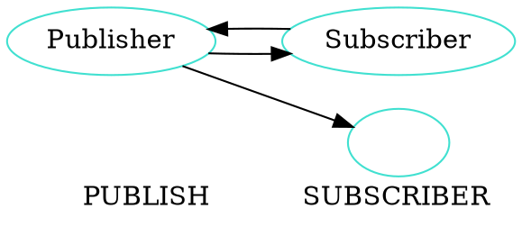
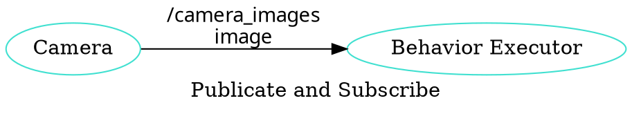

# ROS 2 Programming

 - 수업자료: https://learn.dronemap.io/ros-workshop/ros2/
 - 준비물: ubuntu 20.04 리눅스가 설치된 컴퓨터
 - 참고책: ROS 2로 시작하는 로봇 프로그래밍

----

## 수업 소개

-   목표: 자율 주행 로봇 개발 환경 구축하고 ROS 2를 이용하여 제어 프로그램을 개발 할 수 있다. 
-   교재: [https://learn.dronemap.io/ros-workshop/ros2/#/day1](https://learn.dronemap.io/ros-workshop/ros2/#/day1)
-   코치: 박동희 dongheepark@gmail.com

1. 워크숍 소개, 참가자 소개
2. ROS 2 소개
3. Linux 사용하기
4. ROS 2 개발환경 구성

## Linux 사용하기

-   Ubuntu 20.04 설치
-   주요 명령어 소개(파일 조작, 프로그램설치, 쉘스크립트, git)
-   디렉토리 소개

### 주요 명령어

ls: 파일 또는 디렉토리의 목록을 출력
```
ls
ls -al
```

cd: 디렉토리 이동
```
cd ~
cd ~/Downloads
```

pwd: 현재 디렉토리 출력
```
pwd
```

mkdir: 디렉토리 생성
```
mkdir tmp
```

rm: 파일 또는 디렉토리 지우기
```
rm -rf tmp
```

cat: 파일 입력 또는 출력

```
cat ~/.bashrc
cat > ~/hello.c
```


cp: 파일 또는 디렉토리 복사

```
cp hello.c world.c
```

gcc: c코드 컴파일


```
gcc hello.c -o hello
```

chmod: 파일의 퍼미션 지정

```
chmod +x hello
```

wget: url에서 파일 다운로드

```
wget https://google.com
```

source: 현재 쉘에서 파일을 읽고 실행

```
source ~/.bashrc
```

git: 버전 관리, 코드 다운로드

```
git init
git clone
git checkout
git add
git commit
git reset
git push
```

IP 확인 방법

```
ifconfig -a
ip addr
```

우분트 패키지 설치

```
sudo apt-get update
sudo apt-get install //설치할 패키지
sudo apt-get remove //삭제할 패키지
sudo apt-get upgrade
```


### 코드 편집기 Visual Studio Code 설치

다음 주소에서 Debian. Ubuntu용 패키지 다운받아서 설치

https://code.visualstudio.com/download

```
cd ~/Downloads
sudo dpkg -i code_1.69.2-1658162013_amd64.deb
```

## ROS 2 foxy 개발환경 구성

### PC에 설치된 우분트 20.04에 ROS 2 foxy 설치하기

https://docs.ros.org/en/foxy/Installation/Ubuntu-Install-Debians.html

UTF-8 로케일 설정
```
sudo apt update && sudo apt install locales
sudo locale-gen en_US en_US.UTF-8
sudo update-locale LC_ALL=en_US.UTF-8 LANG=en_US.UTF-8
export LANG=en_US.UTF-8

locale
```


우분트 패키지 소스 리스트에 ROS 2 foxy 추가 

```
sudo apt update && sudo apt install curl gnupg2 lsb-release
sudo curl -sSL https://raw.githubusercontent.com/ros/rosdistro/master/ros.key  -o /usr/share/keyrings/ros-archive-keyring.gpg
```

```
echo "deb [arch=$(dpkg --print-architecture) signed-by=/usr/share/keyrings/ros-archive-keyring.gpg] http://packages.ros.org/ros2/ubuntu $(source /etc/os-release && echo $UBUNTU_CODENAME) main" | sudo tee /etc/apt/sources.list.d/ros2.list > /dev/null
```

ROS foxy 데스크탑 패키지 설치

```
sudo apt-get update
sudo apt install ros-foxy-desktop
```

ROS foxy 환경 변수 설정

```
echo "source /opt/ros/foxy/setup.bash" >> ~/.bashrc
source ~/.bashrc
```

ROS 2 사용자 패키지 빌드를 위한 도구 colcon 설치

```
sudo apt install python3-colcon-common-extensions
```

ROS 2 환경 구분을 위한 도메인 아이디 설정

자신의 도메인 아이디를 ~/.bashrc에 추가 한다. 
```
export ROS_DOMAIN_ID=1 # 강사
export ROS_DOMAIN_ID=2 # ?
export ROS_DOMAIN_ID=3 #
export ROS_DOMAIN_ID=4
export ROS_DOMAIN_ID=5
export ROS_DOMAIN_ID=6
```

사용법
```
ROS_DOMAIN_ID=1 ros2 topic list
```

### Visual Studio Code 확장 설치
 - C/C++, CmMake, CMake Tools, Python
 - ROS, URDF, Colcon Tasks
 - XML Tools, YAML, Markdown All in One

## ROS 2 소개 

### ROS

- Robot Operating System: 로봇 빌드에 사용되는 라이브러리 어플리케이션 모음 <http://www.ros.org/>
- 목표: 로봇을 만들때 기존의 재활용 하고 공유하자.
- History:
	- 2000s: Standford Artificial intelligence
	- 2007: Willow Garage
	- 2013: Open Source Robotics Foundation
	- 2017: ROS 2 첫버전 릴리즈
- 사용 분야: Drone, Kinematic ARMS(로봇암), Wheeled(바퀴), Bi-pedal(이족)

### ROS 2 왜?
 - 리얼타임 
 - 임베디드 시스템 
 - Linux, macOS, Windows 지원
 - 통신 QOS 지원: 안정성 향상
 - 다양한 프로그래밍 언어 호환: RCL 


### ROS 2 구조


### ROS Nodes and Topics


- Perception: Sense
	- Sensor Fusion
	- Filtering
	- Localization 
  
- Dicesion Making: Decide
	- Path Planning
	- Prediction
	- Behavior Planning

- Actuation: Act
	- PID Control
	- Model Predictive Control

### ROS Nodes
 


## ROS 인터페이스

ROS에서 노드간 통신(토픽, 서비스, 액션)할때 이동하는 데이터 타입

미리 정의된 메시지 타입 :
- https://github.com/ros2/common_interfaces

 - 토픽: msg 파일
 - 서비스: srv 파일
 - 액션: action 파일


### Topics

노드간 통신 인터페이스. 구독 발행의 이름


 

### Publish and Subscribe

발행과 구독. 신문/잡지 발행 구독에 비유



실제 예제
 


### ROS Services
- Request-Response, 1:1 통신
- PubSub이 필요 없는 경우 사용, 요청 할때만 데이터가 제공. 네트워크 부하가 적다.
 
### 예시: 카메라 이미지 얻기
 

 


### ROS Action
 - Service + Message Passing
 - 비동기식 양방향 메시지 송수신 방식
 - Goal/Feedback/Result
 


## ROS Turtlesim

Turtle


### Turtlesim 실행하기


1. 환경 변수 설정
   ```
   source /opt/ros/foxy/setup.bash
   ```
2. turtlesim 패키지 설치 확인
   ```
   ros2 pkg executables turtlesim
   ```
2. turtlesim 패키지의 `turtlesim_node` 실행
   ```
   ros2 run turtlesim turtlesim_node
   ```
3. turtlesim 패키지의 `turtle_teleop_key` 실행
   ```
   ros2 run turtlesim turtle_teleop_key
   ```

### Turtlesim 노드 정보

노드 목록 보기 
```
ros2 node list
```

노드 정보 보기 
```
ros2 node info /turtlesim
```

### Turtlesim 토픽 목록
```
ros2 topic list
```

### Turtlesim 토픽 정보
`cmd_vel` 토픽 정보 보기 

```
ros2 topic info /turtle1/cmd_vel
```

토픽 publish

```
ros2 topic pub --once /turtle1/cmd_vel geometry_msgs/msg/Twist '{linear: {x: 2.0, y: 0.0, z: 0.0}, angular: {x: 0.0, y: 0.0, z: 1.8}}
```

### Turtlesim 메시지 정보
```
$ ros2 interface show geometry_msgs/Twist
geometry_msgs/Vector3 linear
  float64 x
  float64 y
  float64 z
geometry_msgs/Vector3 angular
  float64 x
  float64 y
  float64 z
```

### Turtlesim Echo a Topic

디버깅시 편리

```
ros2 topic echo /turtle1/cmd_vel
```


### `rqt_graph`

    rqt_graph


### `rqt_plot`


### Turtlesim 서비스 정보
서비스 목록 

```
ros2 service list -t
```

서비스 Call
```
ros2 service call /spawn turtlesim/srv/Spawn "{x: 2, y: 2, theta: 0.2, name: ''}"
```

### Turtlesim Action 정보

액션 목록 
```
ros2 action list -t
```

액션 정보
```
ros2 action info /turtle1/rotate_absolute
```

액션 골 보내기 -90도 회전 
```
ros2 action send_goal /turtle1/rotate_absolute turtlesim/action/RotateAbsolute {'theta:
-1.57'}
```

### Turtlesim Parameter 정보

```
ros2 param list
```

### rosbag2

노드 간 통신 메시지를 bag에 녹화하고 재생

bag 녹화
```
ros2 bag record /turtle1/cmd_vel
```

녹화된 bag 정보
```
ros2 bag info rosbag2_2022_07_24-20_10_23/
```

bag 재생
```
ros2 bag play rosbag2_2022_07_24-20_10_23/
```


## 참고
 - ROS 2 Documentaion: Foxy https://docs.ros.org/en/foxy/Tutorials.html
 
 