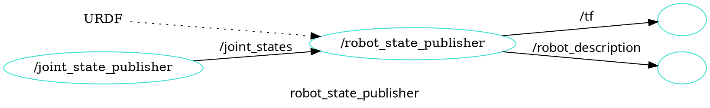

# ROS 2 Programming Day 2

- 수업자료: https://learn.dronemap.io/ros-workshop/ros2/
- 준비물: ubuntu 20.04 리눅스가 설치된 컴퓨터
- 참고책: ROS 2로 시작하는 로봇 프로그래밍

## 수업 소개

- 목표: 시뮬레이터를 이용하여 노드를 프로그래밍 할 수 있다.
- 교재: [https://learn.dronemap.io/ros-workshop/ros2/#/day2](https://learn.dronemap.io/ros-workshop/ros2/#/day2)
- 코치: 박동희 dongheepark@gmail.com

1. 자율 주행 시뮬레이터 실습

- 로봇 모델 만들기
- SLAM 소개
- ROS와 시뮬레이터를 이용하여 SLAM 실습

2. 차동 구동 드라이버 만들기

- 인코더와 모터
- 피드백 제어
- 시리얼 인터페이스

3. Raspberry Pi에 ROS 2 개발 환경 구성

- 네트워크 설정
- Raspberry Pi에 ROS 2 설치
- 모터, 엔코더 ROS 노드 만들기

## 로봇 모델 만들기

ROS에서 사용하는 로봇 모델 만들기

- 차동 구동 로봇
- 로봇 구조 설명
  - TF, FRAME
  - `/robot_description`
- URDF 작성
- 로봇 모델을 시뮬레이터에서 실행

### 차동 구동 로봇

- 왼쪽 오른쪽 바퀴 두개에, 캐스터 휠이 하나 있는 로봇 
- 자유도 높은 움직임. 간단한 구조
- 터틀봇 시리즈

모바일 로봇에 대한 ROS REP 표준
 - REP 105: 로봇 프레임의 주요 좌표계 `base_link` https://www.ros.org/reps/rep-0105.html#base-link
 - REP 103: 좌표계의 방향에 대한 표준, X(앞), Y(왼쪽), Z(위)

### TF: Transform System


ros2 run tf2_ros static_transform_publisher x y z yaw pitch roll parent_frame child_frame

world 프레임으로부터 robot_1 프레임에 대한 정의를 내려보자. x 방향 2, y 방향 1, yaw 방향 0.785 라디언

```
ros2 run tf2_ros static_transform_publisher 2 1 0 0.785 0 0 world robot_1
```


`robot_1`과 `robot_2`의 관계를 내려보자. `robot_2`는 `robot_1`의 1만큼 x 방향(앞)에 있다.
```
ros2 run tf2_ros static_transform_publisher 1 0 0 0 0 0 robot_1 robot_2
```

#### 해보기: `robot_1`는 `world` 좌표계를 기준으로 어디에 있나?

- robot_1의 위치와 방향을 계산해보자. 
- rviz를 이용해서 `world`, `robot_1`, `robot_2`의 관계 보기

```
rviz2
```


### `/robot_description`

`robot_state_publisher`

`sensor_msgs/JointState` 메시지와 URDF 파일을 입력 받아서 로봇의 3D 모델(즉, 로봇의 전체 형태)의 현재 상태를 계산하여, TF(Joint Transforms)와, /robot_description 메시지(URDF Data) 발행



`joint_state_publisher_gui` 를 이용하여  /joint_state


```
ros2 run robot_state_publisher robot_state_publisher --ros-args -p robot_description:="$(xacro path/to/my/xacro/file.urdf.xacro)"
```

```
ros2 run joint_state_publisher_gui joint_state_publisher_gui
```

```
ros2 run tf2_tools view_frames.py
```

### URDF 작성

Unified Robot Description Format

모델 구성 요소
 - LINK
 - JOINT
 - URDF: Unified Robot Description Format. 로봇의 geometry와 구성을 명세.
 - 관성모멘트: 주어진 축을 중심으로 일어나는 회전 운동을 변화시키기 어려운 정도

Link 


```
 <link name="my_link">
   <inertial>
     <origin xyz="0 0 0.5" rpy="0 0 0"/>
     <mass value="1"/>
     <inertia ixx="100"  ixy="0"  ixz="0" iyy="100" iyz="0" izz="100" />
   </inertial>

   <visual>
     <origin xyz="0 0 0" rpy="0 0 0" />
     <geometry>
       <box size="1 1 1" />
     </geometry>
     <material name="Cyan">
       <color rgba="0 1.0 1.0 1.0"/>
     </material>
   </visual>

   <collision>
     <origin xyz="0 0 0" rpy="0 0 0"/>
     <geometry>
       <cylinder radius="1" length="0.5"/>
     </geometry>
   </collision>
 </link>
```

Joint


```
 <joint name="my_joint" type="floating">
    <origin xyz="0 0 1" rpy="0 0 3.1416"/>
    <parent link="link1"/>
    <child link="link2"/>

    <calibration rising="0.0"/>
    <dynamics damping="0.0" friction="0.0"/>
    <limit effort="30" velocity="1.0" lower="-2.2" upper="0.7" />
    <safety_controller k_velocity="10" k_position="15" soft_lower_limit="-2.0" soft_upper_limit="0.5" />
 </joint>
```

ros2-control gazebo-ros2-control 설치

```
sudo apt install ros-foxy-ros2-control ros-foxy-ros2-controllers ros-foxy-gazebo-ros2-control ros-foxy-xacro
```

자라 로봇의 주요 수치
- 샷시의 지름 30cm
- 샷시의 높이 5cm 
- 샷시의 무게 500g
- 바퀴의 크기 반지름 3.5cm
- 바퀴의 두께 2cm
- 바퀴의 무게 50g
- 캐스터 휠의 반지름 1cm
- 캐스터 휠의 무게 1cm
- 훨간격 22.4cm
- (샷시로부터) 라이다 높이 13cm

1. robot.urdf.xacro

2. robot_core.xacro

3. rviz


해보기

- wheel 바퀴 크기를 반지름 3.5cm 에서 7cm으로 바뀌기
- lidar의 높이를 10cm에서 5cm 높이로 바꾸어 보자
 
## 로봇 모델을 시뮬레이터에서 실행

gazebo

`/robot_state_publisher`를 실행하여, URDF를 `/robot_description` 토픽으로 보내기

```
ros2 launch firstbot_description rsp.launch.py use_sim_time:=true
```

gazebo 실행

```
ros2 launch gazebo_ros gazebo.launch.py
```

robot을 gazebo에 올리기

```
ros2 run gazebo_ros spawn_entity.py -topic robot_description -entity zara
```

### Gazebo Control

`ros2_control` 하드웨어 로봇과 시뮬레이터 로봇 인터페이스 제공

`/cmd_vel`을 입력 받아서 로봇(하드웨어 또는 시뮬레이터 로봇) 제어

하드웨어 로봇 토픽 흐름


시뮬레이터 로봇 토픽 흐름


### 테스트

시뮬레이터 launch 실행 (rsp, gazebo, gazebo_ros 실행)

```
ros2 launch firstbot_description launch_sim.launch.py use_sim_time:=true
```

키보드 teleop

```
ros2 run teleop_twist_keyboard teleop_twist_keyboard
```

cartographer
```
ros2 launch firstbot_cartographer cartographer_rviz.launch.py use_sim_time:=True
```

save map
```
ros2 run nav2_map_server map_saver_cli -f map
```

navigation2
```
ros2 launch firstbot_navigation2 navigation2.launch.py map:=$HOME/map.yaml use_sim_time:=True
```


## SLAM 소개

Simultaneous Localization and Mapping 동시적 위치추정 및 지도작성

자율주행 차량에 사용되어 주변 환경 지도를 작성하는 동시에 차량의 위치를 작성된 지도 안에서 추정하는 방법

미지의 장소의 지도 작성!


종류

- vSLAM: 카메라 이용.
  - PTAM, ORB-SLAM 알고리즘 사용
- 라이다 SLAM: 라이다 센서 이용. 포인트 클라우드 생성.
  - 포인트 클라우드 합치기 알고리즘: ICP, NDT

특징

- 실시간 지도 생성
- 누적 오차 발생
- 높은 계산 비용

## Gazebo 시뮬레이터를 이용하여 SLAM 실습

Gazebo 시뮬레이터를 이용하여, SLAM과 자율 주행을 테스트 해보자.

### 시뮬레이터 Gazebo

#### Gazebo 11 설치

```
sudo sh -c 'echo "deb http://packages.osrfoundation.org/gazebo/ubuntu-stable `lsb_release -cs` main" > /etc/apt/sources.list.d/gazebo-stable.list'
wget https://packages.osrfoundation.org/gazebo.key -O - | sudo apt-key add -
sudo apt update
sudo apt install gazebo11 libgazebo11-dev

gazebo
```

가상 머신에서 에러가 나는 경우 다음 실행후 다시 gazebo 실행

```
export SVGA_VGPU10=0
```

#### ROS Gazebo 패키지 설치

```
sudo apt install ros-foxy-gazebo-dev ros-foxy-gazebo-plugins ros-foxy-gazebo-msgs  ros-foxy-gazebo-ros-pkgs ros-foxy-gazebo-ros ros-foxy-ros-core ros-foxy-geometry2
```

#### SLAM, Navigation 패키지 설치

```
sudo apt install ros-foxy-cartographer
sudo apt install ros-foxy-cartographer-ros
sudo apt install ros-foxy-navigation2
sudo apt install ros-foxy-nav2-bringup
```

#### 퍼스트봇 ZARA 패키지 설치

- `firstbot_base`: controller_manager를 이용한 하드웨어 인터페이스
- `firstbot_bringup`: 하드웨어 드라이버 실행 (카메라 ,라이다, 모터 컨트롤러)
- `firstbot_control`: Configurations for the diff_drive_controller of ROS Control used in Gazebo simulation and the real robot.
- `firstbot_description`: FirstBot의 URDF 
- `firstbot_gazebo`: FirstBot의 시뮬레이션을 위한 launch 파일과 설정
- `firstbot_navigation`: FirstBot의 네비게이션을 위한 launch 파일과 설정 
- `firstbot_slam`: SLAM을 위한 설정

패키지 다운로드: https://github.com/donghee/firstbot_zara/tree/foxy

```
mkdir -p ~/firstbot_ws/src
cd ~/firstbot_ws/src
git clone https://github.com/donghee/firstbot_zara.git -b foxy --recursive
```

패키지 빌드

```
cd ~/firstbot_ws
colcon build --symlink-install
source install/setup.bash
echo "source ~/firstbot_ws/install/setup.bash" >> ~/.bashrc
#echo "export GAZEBO_MODEL_PATH=$GAZEBO_MODEL_PATH:~/firstbot_ws/src/firstbot_zara/firstbot_description/models" >> ~/.bashrc
source ~/.bashrc
```

gazebo 모델 추가

```
mkdir -p ~/.gazebo/models
cp -Rf ~/firstbot_ws/src/firstbot_zara/firstbot_description/models/* ~/.gazebo/models
```

#### 시뮬레이터 실행

```
ros2 launch firstbot_description launch_sim.launch.py use_sim_time:=true
```


맵생성

```
ros2 launch firstbot_cartographer cartographer.launch.py use_sim_time:=true
```

```
ros2 launch firstbot_cartographer cartographer_rviz.launch.py use_sim_time:=true
```


키보드 입력

```
ros2 run teleop_twist_keyboard teleop_twist_keyboard
```

토픽, 서비스 확인

```
ros2 topic list
ros2 service list
ros2 topic pub /cmd_vel geometry_msgs/Twist '{linear: {x: 1.0}}' -1
ros2 topic pub /cmd_vel geometry_msgs/Twist '{linear: {x: 0.0}}' -1
```

맵과 로봇 프레임 좌표 연결 확인

```
ros2 run tf2_ros tf2_echo base_footprint map
```

프레임 좌표 연결 확인

```
ros2 topic echo /odom
ros2 run tf2_tools view_frames.py
```

맵 저장

```
cd ~/firstbot_ws
ros2 run nav2_map_server map_saver_cli -f map
```

네비게이션 실행. 자율 주행!

```
cd ~/firstbot_ws
ros2 launch firstbot_navigation2 navigation2.launch.py use_sim_time:=true map:=./map.yaml
```

```
ros2 launch firstbot_navigation2 navigation2_rviz.launch.py
```


<!--  -->

#### 해보기: gazebo에서 브릭 박스로 장애물을 구성해서 자율 주행을 해보자.


## Raspberry Pi 4에 ROS 2 설치

준비물

- [Ubuntu 20.04: Raspberry Pi Generic (64-bit ARM) preinstalled server image](https://cdimage.ubuntu.com/releases/20.04/release/)
- balenaEther
- SD카드 32GB

### ROS 2 설치 준비

- 키보드, 모니터 연결하여 네트워크 설정
- timezone 설정
- swap 추가
- ROS_DOMAIN_ID 설정: 노트북, Raspberry Pi 같은 도메인 ID로 지정.

#### WIFI 네트워크 설정

- WIFI AP: "baribarilab"
- WIFI PASSWORD: "1111100000"

sudo nano /etc/netplan/50-cloud-init.yaml

```
network:
  version: 2
  ethernets:
    eth0:
      dhcp4: true
      optional: true
  wifis:
    wlan0:
      dhcp4: true
      optional: true
      access-points:
        "YOUR_WIFI_NAME":
          password: "YOUR_WIFI_PASSWORD"
```

```
sudo netplan --debug apply
```

```
ip address
```

#### Timezone 설정

timezone Asia/Seoul 설정

```
timedatectl set-timezone Asia/Seoul
```

#### hostname 변경

sudo nano /etc/hostname

```
ubuntu
```

#### Swap 추가

Swap 추가

```
sudo fallocate -l 1G /swapfile
sudo chmod 600 /swapfile
sudo mkswap /swapfile
```

Swap 생성 확인

```
Setting up swapspace version 1, size = 1024 MiB (1073737728 bytes)
no label, UUID=09c9cd5c-f066-48f0-b988-7b000b69ed3d
```

Swap 추가

```
sudo swapon /swapfile
```

swapfile 파티션 테이블에 /swapfile 추가

```
sudo nano /etc/fstab
```

```
/swapfile swap swap defaults 0 0
```

swap 확인

```
sudo free -h

total        used        free      shared  buff/cache   available
Mem:           906M        144M        553M        6.6M        208M        740M
Swap:          1.0G          0B        1.0G
```

### ROS 2 Foxy 패키지 설치

```
sudo curl -sSL https://raw.githubusercontent.com/ros/rosdistro/master/ros.key  -o /usr/share/keyrings/ros-archive-keyring.gpg
echo "deb [arch=$(dpkg --print-architecture) signed-by=/usr/share/keyrings/ros-archive-keyring.gpg] http://packages.ros.org/ros2/ubuntu $(source /etc/os-release && echo $UBUNTU_CODENAME) main" | sudo tee /etc/apt/sources.list.d/ros2.list > /dev/null
sudo apt update
```

```
sudo apt install ros-foxy-ros-base -y
```

빌드 도구 설치하기

```
sudo apt install python3-colcon-common-extensions python3-rosdep2 build-essential libboost-dev
```

base 패키지는 GUI툴이 포함되어 있지 않다.

```
echo "source /opt/ros/foxy/setup.bash" >>~/.bashrc
```

### 원격 접속하기

- 아이디 ubuntu
- 암호: ubuntu

```
ssh ubuntu@192.168.88.??
```

### 하드웨어 설치

#### 

#### 모터 드라이버

#### 카메라

#### 라이다


