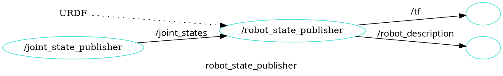

# FirstBot Zara 패키지 소개

- `firstbot_base`: controller_manager를 이용한 하드웨어 인터페이스
- `firstbot_bringup`: 하드웨어 드라이버 실행 (카메라 ,라이다, 모터 컨트롤러)
- `firstbot_control`: Configurations for the diff_drive_controller of ROS Control used in Gazebo simulation and the real robot.
- `firstbot_description`: FirstBot의 URDF 
- `firstbot_gazebo`: FirstBot의 시뮬레이션을 위한 launch 파일과 설정
- `firstbot_navigation`: FirstBot의 네비게이션을 위한 launch 파일과 설정 
- `firstbot_slam`: SLAM을 위한 설정

---

### 차동 구동 로봇

- 왼쪽 오른쪽 바퀴 두개에, 캐스터 휠이 하나 있는 로봇 
- 자유도 높은 움직임. 간단한 구조
- 터틀봇 시리즈

ROS REP 표준
 - REP 105: 로봇 프레임의 주요 좌표계 `base_link` https://www.ros.org/reps/rep-0105.html#base-link
 - REP 103: 좌표계의 방향에 대한 표준, X(앞), Y(왼쪽), Z(위)

### TF: Transform System


ros2 run tf2_ros static_transform_publisher x y z yaw pitch roll parent_frame child_frame

world 프레임으로부터 robot_1 프레임에 대한 정의를 내려보자. x 방향 2, y 방향 1, yaw 방향 0.785 라디언

```
ros2 run tf2_ros static_transform_publisher 2 1 0 0.785 0 0 world robot_1
```


`robot_1`과 `robot_2`의 관계를 내려보자. `robot_2`는 `robot_1`의 1만큼 x 방향(앞)에 있다.
```
ros2 run tf2_ros static_transform_publisher 1 0 0 0 0 0 robot_1 robot_2
```


`world`, `robot_1`, `robot_2`의 관계 보기

```
ros2 run rviz2 rviz2
```

URDF 작성


# 
`robot_state_publisher`

`sensor_msgs/JointState` 메시지와 URDF를 받아서 로봇의 3D 모델(즉, 로봇의 전체 형태)의 현재 상태를 계산하여, TF와, /robot_description 메시지 발행



`joint_state_publisher_gui` 를 이용하여  /joint_state
