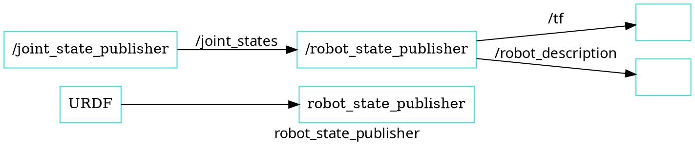

# FirstBot Zara 패키지 소개

- `firstbot_base`: controller_manager를 이용한 하드웨어 인터페이스
- `firstbot_bringup`: 하드웨어 드라이버 실행 (카메라 ,라이다, 모터 컨트롤러)
- `firstbot_control`: Configurations for the diff_drive_controller of ROS Control used in Gazebo simulation and the real robot.
- `firstbot_description`: FirstBot의 URDF 
- `firstbot_gazebo`: FirstBot의 시뮬레이션을 위한 launch 파일과 설정
- `firstbot_navigation`: FirstBot의 네비게이션을 위한 launch 파일과 설정 
- `firstbot_slam`: SLAM을 위한 설정

---

# 
`robot_state_publisher`

sensor_msgs/JointState 메시지와 URDF를 받아서 로봇의 3D 모델(즉, 로봇의 전체 형태)의 현재 상태를 계산하여, TF와, /robot_description 메시지 발행

`joint_state_publisher_gui` 를 이용하여  /joint_state
