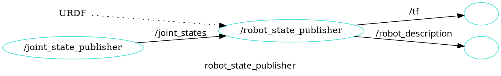

## 로봇 모델 만들기

ROS에서 사용하는 로봇 모델 만들기

차동 구동 로봇
로봇 구조 설명
 - FRAME
 - TF
 - `/robot_description`
URDF 작성

### 차동 구동 로봇

- 왼쪽 오른쪽 바퀴 두개에, 캐스터 휠이 하나 있는 로봇 
- 자유도 높은 움직임. 간단한 구조
- 터틀봇 시리즈

모바일 로봇에 대한 ROS REP 표준
 - REP 105: 로봇 프레임의 주요 좌표계 `base_link` https://www.ros.org/reps/rep-0105.html#base-link
 - REP 103: 좌표계의 방향에 대한 표준, X(앞), Y(왼쪽), Z(위)

### TF: Transform System


ros2 run tf2_ros static_transform_publisher x y z yaw pitch roll parent_frame child_frame

world 프레임으로부터 robot_1 프레임에 대한 정의를 내려보자. x 방향 2, y 방향 1, yaw 방향 0.785 라디언

```
ros2 run tf2_ros static_transform_publisher 2 1 0 0.785 0 0 world robot_1
```


`robot_1`과 `robot_2`의 관계를 내려보자. `robot_2`는 `robot_1`의 1만큼 x 방향(앞)에 있다.
```
ros2 run tf2_ros static_transform_publisher 1 0 0 0 0 0 robot_1 robot_2
```

#### 해보기: `robot_1`는 `world` 좌표계를 기준으로 어디에 있나?

- robot_1의 위치와 방향을 계산해보자. 
- rviz를 이용해서 `world`, `robot_1`, `robot_2`의 관계 보기

```
rviz2
```


### `/robot_description`

`robot_state_publisher`

`sensor_msgs/JointState` 메시지와 URDF 파일을 입력 받아서 로봇의 3D 모델(즉, 로봇의 전체 형태)의 현재 상태를 계산하여, TF(Joint Transforms)와, /robot_description 메시지(URDF Data) 발행



`joint_state_publisher_gui` 를 이용하여  /joint_state


```
ros2 run robot_state_publisher robot_state_publisher --ros-args -p robot_description:="$(xacro path/to/my/xacro/file.urdf.xacro)"
```

```
ros2 run joint_state_publisher_gui joint_state_publisher_gui
```

```
ros2 run tf2_tools view_frames.py
```

---

### URDF

Unified Robot Description Format

자라 로봇의 주요 수치
- 샷시의 지름 30cm
- 샷시의 높이 5cm 
- 샷시의 무게 500g
- 바퀴의 크기 반지름 3.5cm
- 바퀴의 두께 2cm
- 바퀴의 무게 50g
- 캐스터 휠의 반지름 1cm
- 캐스터 휠의 무게 1cm
- 훨간격 22.4cm
- (샷시로부터) 라이다 높이 13cm

1. robot.urdf.xacro

2. robot_core.xacro

3. rviz


해보기

- wheel 바퀴 크기를 반지름 3.5cm 에서 7cm으로 바뀌기
- lidar의 높이를 10cm에서 5cm 높이로 바꾸어 보자
 
## 로봇 모델을 시뮬레이터에서 실행

gazebo

`/robot_state_publisher`를 실행하여, URDF를 `/robot_description` 토픽으로 보내기

```
ros2 launch firstbot_description rsp.launch.py use_sim_time:=true
```

gazebo 실행

```
ros2 launch gazebo_ros gazebo.launch.py
```

robot을 gazebo에 올리기

```
ros2 run gazebo_ros spawn_entity.py -topic robot_description -entity zara
```

### Gazebo Control

`ros2_control` 하드웨어 로봇과 시뮬레이터 로봇 인터페이스 제공

`/cmd_vel`을 입력 받아서 로봇(하드웨어 또는 시뮬레이터 로봇) 제어

하드웨어 로봇 토픽 흐름


시뮬레이터 로봇 토픽 흐름


### 테스트

시뮬레이터 launch 실행 (rsp, gazebo, gazebo_ros 실행)

```
ros2 launch firstbot_description launch_sim.launch.py use_sim_time:=true
```

키보드 teleop

```
ros2 run teleop_twist_keyboard teleop_twist_keyboard
```

cartographer
```
ros2 launch firstbot_cartographer cartographer_rviz.launch.py use_sim_time:=True
```

save map
```
ros2 run nav2_map_server map_saver_cli -f map
```

navigation2
```
ros2 launch firstbot_navigation2 navigation2.launch.py map:=$HOME/map.yaml use_sim_time:=True
```


---

## FirstBot Zara 패키지 소개

- `firstbot_base`: controller_manager를 이용한 하드웨어 인터페이스
- `firstbot_bringup`: 하드웨어 드라이버 실행 (카메라 ,라이다, 모터 컨트롤러)
- `firstbot_control`: Configurations for the diff_drive_controller of ROS Control used in Gazebo simulation and the real robot.
- `firstbot_description`: FirstBot의 URDF 
- `firstbot_gazebo`: FirstBot의 시뮬레이션을 위한 launch 파일과 설정
- `firstbot_navigation`: FirstBot의 네비게이션을 위한 launch 파일과 설정 
- `firstbot_slam`: SLAM을 위한 설정

---


